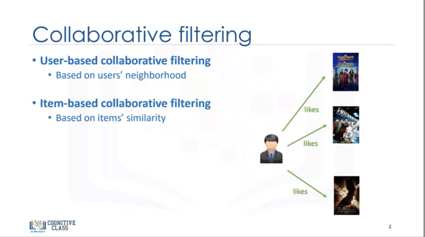
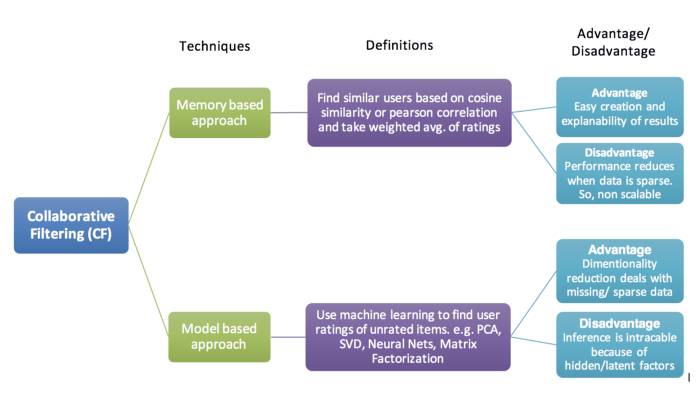
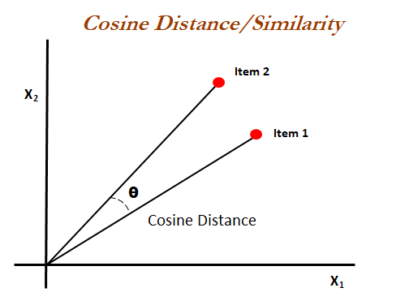

# A-Movie-Recommender-System

Recommendation systems are a collection of algorithms used to recommend items to users based on information taken from the user. These systems have become ubiquitous, and can be commonly seen in online stores, movies databases and job finders. In this notebook, I will implement Collaborative and Content-based recommendation systems using Python and the Pandas library.

</img>

## Collaborative Filtering

Collaborative Filtering is also known as User-User Filtering. As hinted by its alternate name, this technique uses other users to recommend items to the input user. It attempts to find users that have similar preferences and opinions as the input and then recommends items that they have liked to the input. There are several methods of finding similar users (Even some making use of Machine Learning), and the one I will be using here is going to be based on the Pearson Correlation Function.

</img>

#### User-based : For a user U, with a set of similar users determined based on rating vectors consisting of given item ratings, the rating for an item I, which hasn’t been rated, is found by picking out N users from the similarity list who have rated the item I and calculating the rating based on these N ratings.

#### Item-based : For an item I, with a set of similar items determined based on rating vectors consisting of received user ratings, the rating by a user U, who hasn’t rated it, is found by picking out N items from the similarity list that have been rated by U and calculating the rating based on these N ratings.

</img>

Similarity Score :
How does it decide which item is most similar to the item user likes? Here we use the similarity scores.
It is a numerical value ranges between zero to one which helps to determine how much two items are similar to each other on a scale of zero to one. This similarity score is obtained measuring the similarity between the text details of both of the items. So, similarity score is the measure of similarity between given text details of two items. This can be done by cosine-similarity.

## How Cosine Similarity works?
Cosine similarity is a metric used to measure how similar the documents are irrespective of their size. Mathematically, it measures the cosine of the angle between two vectors projected in a multi-dimensional space. The cosine similarity is advantageous because even if the two similar documents are far apart by the Euclidean distance (due to the size of the document), chances are they may still be oriented closer together. The smaller the angle, higher the cosine similarity.

</img>

# How to run this project (In your System)?

1. Clone or download this repository to your local machine.
2. Install all the libraries mentioned in the requirements.txt file with the command pip install -r requirements.txt
Python version - Python 3.9.5
3. Unzip All Zip Files - Dataset, model, etc.  
<a href="https://drive.google.com/drive/folders/1ZxdD_jSt85_CWibJaza1-4I3Th_6bKzq?usp=sharing">pickle model</a>   
OR   
<a href="https://drive.google.com/drive/folders/1ycuddL3mt-WDkNc_9Vo83tan5VsMk0nl?usp=sharing">Joblib model</a>
5. Open your terminal/command prompt from your project directory and run the file Deploy.py by executing the command -> python Deploy.py
OR Direct executing the command -> streamlit run Deploy.py
5. Go to your browser and type http://localhost:8501 in the address bar.
6. Done 
If any Issue face then contact me alpeshpatel03434@gmail.com

## Deploy model in Streamlit

Live Server - https://share.streamlit.io/alpeshpatel03434/a-movie-recommender-system/main/Deploy.py
OR <a href="https://share.streamlit.io/alpeshpatel03434/a-movie-recommender-system/main/Deploy.py">Run it Live on Server</a>

## Dataset Used :

<a href="https://www.kaggle.com/carolzhangdc/imdb-5000-movie-dataset">IMDB 5000 Movie Dataset</a>

# Project file - Movie Recommender System.ipynb 

Movie Recommender System Using User-User Filtering through the Pearson Correlation Coefficient
